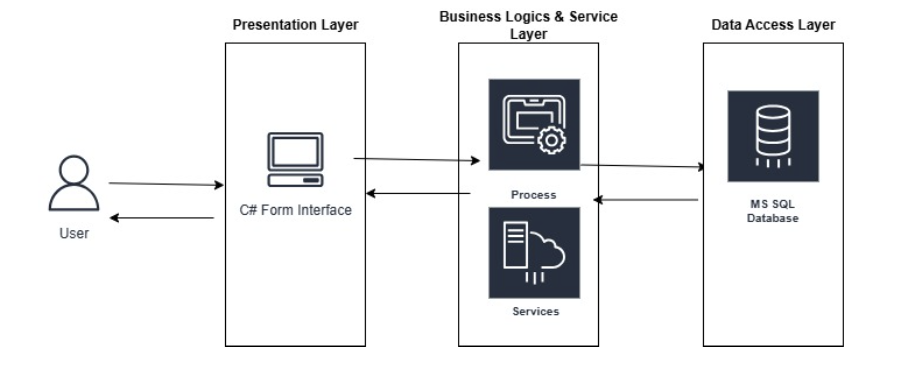
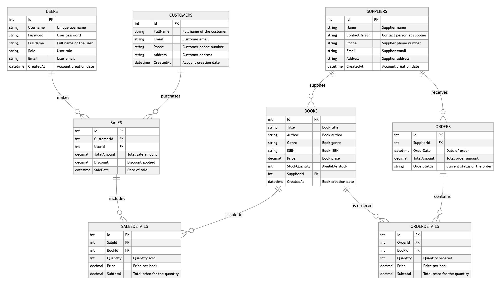
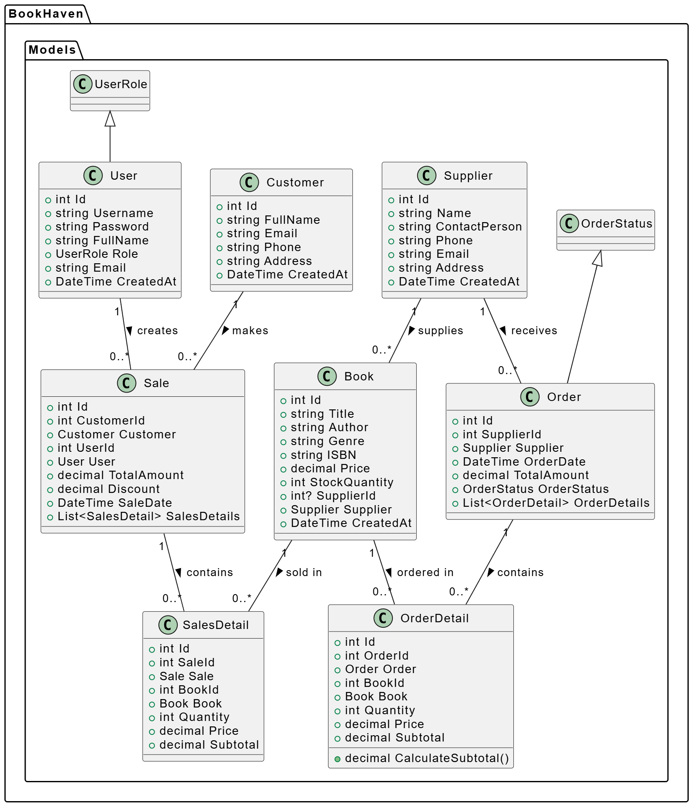
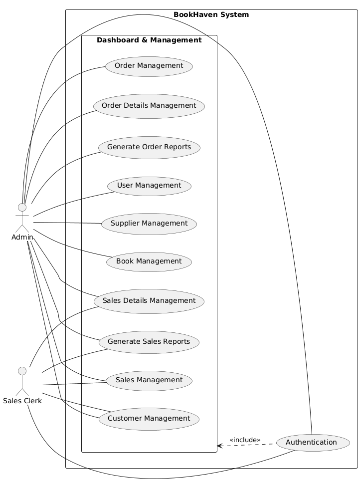
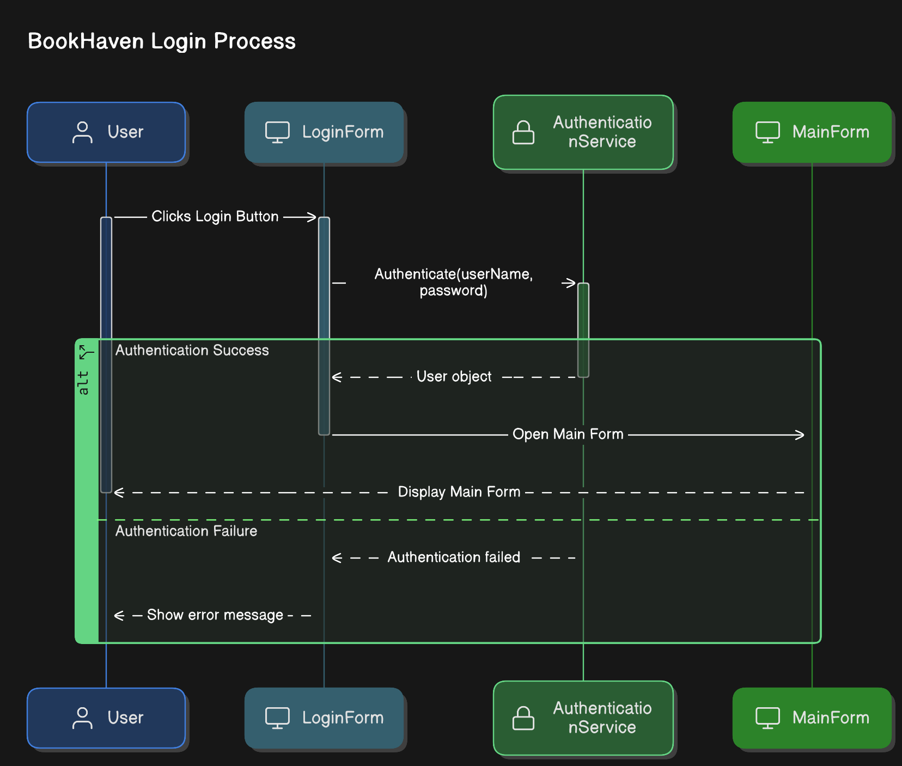
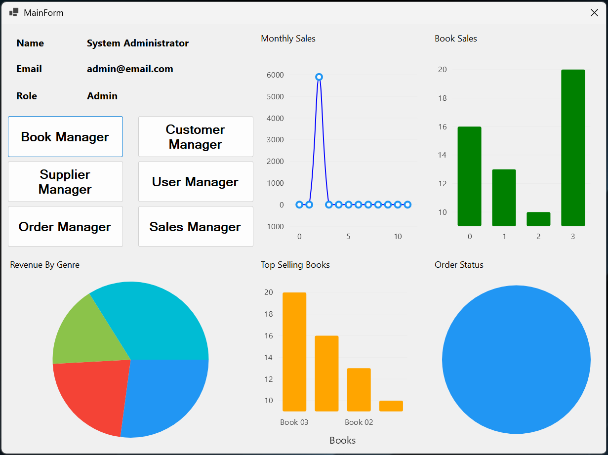
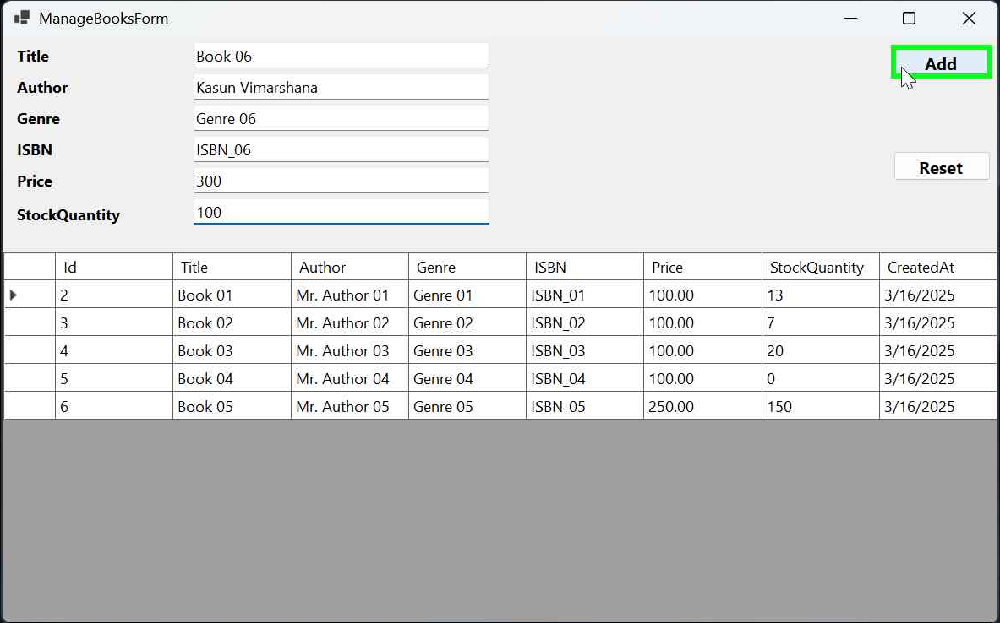
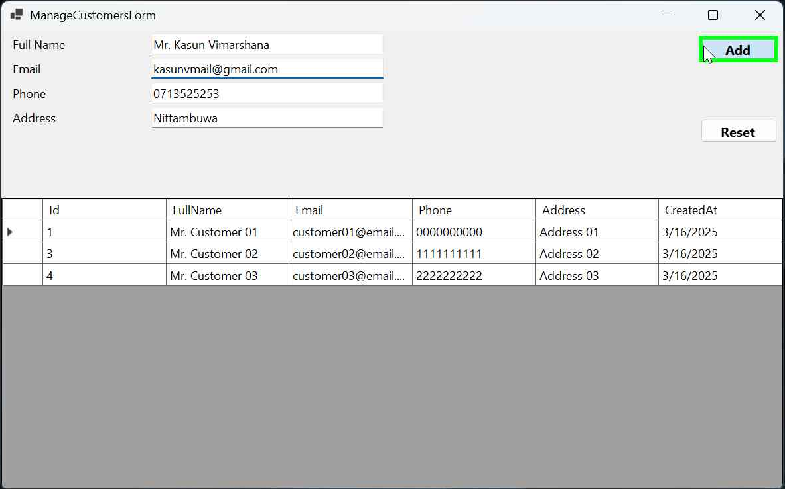
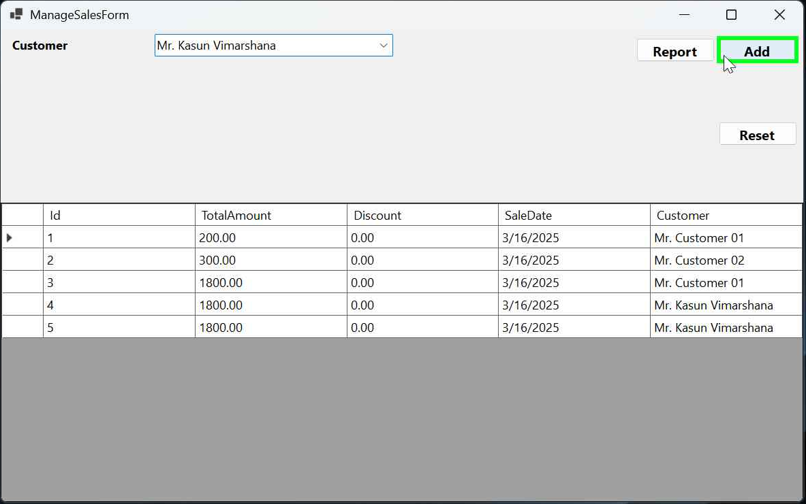

# BookHaven - Bookstore Management System

  
*A comprehensive bookstore management system built with C# and Windows Forms.*

## 📌 Table of Contents
- [Overview](#overview)
- [Features](#features)
- [Technologies Used](#technologies-used)
- [Installation Guide](#installation-guide)
- [Screenshots](#screenshots)
- [Database Schema](#database-schema)
- [Architecture](#architecture)
- [License](#license)
- [Contributors](#contributors)
- [Contact](#contact)

## 📖 Overview
BookHaven is a desktop application designed for bookstore owners to manage books, customers, sales transactions, orders, and suppliers efficiently. The system provides authentication, role-based access, reporting, and analytics features.

## ✨ Features
- 📚 **Book Inventory Management**
- 👥 **Customer Management**
- 💰 **Sales and Orders Management**
- 📊 **Admin Dashboard with Reports**
- 🔑 **Authentication & Role-based Access**
- 🔍 **Search and Filter Options**
- 🔄 **Data Backup & Restore Support**
- 📈 **Sales Analytics**

## 🛠 Technologies Used
- **C# .NET (WinForms)**
- **MSSQL Database**
- **LiveCharts for Data Visualization**

## 🚀 Installation Guide
### Prerequisites:
- Install **.NET 7.0 SDK** or later
- Install **Microsoft SQL Server** and **SQL Server Management Studio (SSMS)**

### Steps:
1. Clone the repository:
   ```sh
   git clone https://github.com/kasunvimarshana/BookHaven.git
   ```
2. Open `BookHaven.sln` in Visual Studio.
3. Restore NuGet packages:
   ```sh
   dotnet restore
   ```
4. Configure the database:
   - Open `BookHavenDB.mdf` in SQL Server
   - Run the necessary migrations
5. Build and run the project:
   ```sh
   dotnet build
   dotnet run
   ```

## 🏛 Database Schema
The system uses an **MSSQL database** with the following tables:
- `Users`
- `Books`
- `Customers`
- `Orders`
- `OrderDetails`
- `Sales`
- `Suppliers`

## 🏗 Architecture
The system follows a **three-layered architecture (MVC-based design)**:
- **Presentation Layer:** Windows Forms (UI)
- **Business Logic Layer (BLL):** Handles business logic
- **Data Access Layer (DAL):** Database interaction

<!--  -->


## UML Diagrams
The following UML diagrams illustrate the system design:

### Entity-Relationship Diagram (ERD)


### Class Diagram


### Use Case Diagram


### Sequence Diagram


## 📸 Screenshots
Below are screenshots of the application:

### Login Screen


### Admin Dashboard


### Book Inventory Management


### Customer Management


### Sales Transactions


## 📜 License
This project is licensed under the **MIT License**. See the [LICENSE.md](./LICENSE.md) file for details.

## 👨‍💻 Contributors
- **Kasun Vimarshana** - Developer

## 📞 Contact
For any queries, feel free to reach out:
- Email: [kasunvmail@gmail.com](mailto:kasunvmail@gmail.com)
- GitHub: [github.com/kasunvimarshana](https://github.com/kasunvimarshana)
